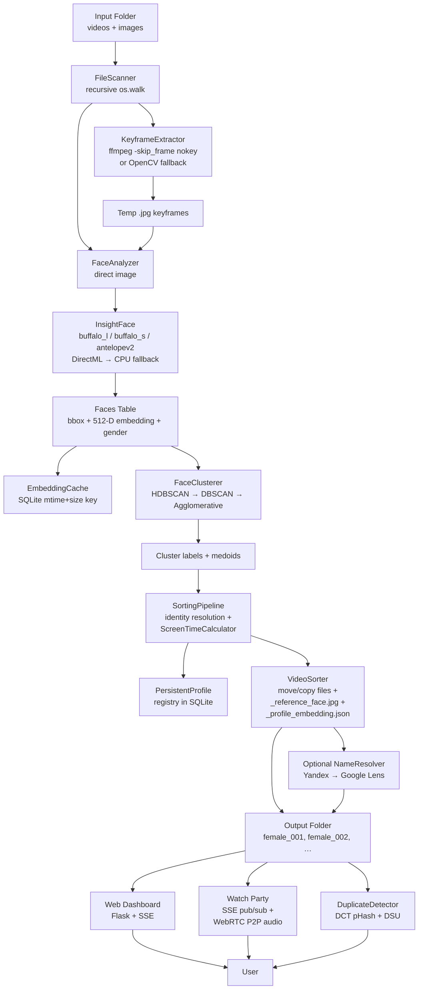

# AuraSort — Premium AI Face Sorter & Media Organizer

AuraSort is a high-performance, AI-driven media sorting and visualization application. It is designed to scan video and image libraries, extract and recognize human faces, cluster them by unique identity using DBSCAN, rename sorted folders automatically using reverse image search, and host synchronized multi-user watch parties.

The application features a premium dark-mode web dashboard with real-time progress logging, DirectML GPU hardware acceleration (with CPU fallback), a customized Plyr video player with lightbox controls, and a fully featured watch party system featuring full-mesh WebRTC voice chat and SSE signaling.

---

## 🌟 Key Features

- **AI Face Detection & Recognition**: Integrates **InsightFace** models (`buffalo_l`, `buffalo_s`, or `antelopev2`) to detect and generate unit-length 512-D face embeddings.
- **Intelligent Gender Filtering**: Filters and clusters target profiles based on configurable gender confidence thresholds (optimized for female face clustering).
- **Advanced Keyframe Extraction**: Utilizes **FFmpeg** to extract high-quality video frames (either I-frames via `-skip_frame nokey` or custom time intervals) to scan long videos efficiently.
- **DBSCAN Clustering & Profile Syncing**: Groups face embeddings into distinct identities using Euclidean distance (equivalent to cosine similarity on normalized vectors). Renaming is kept in sync with the SQLite/PostgreSQL caching database.
- **Reverse Image Search & Auto-Naming**: Renames identity folders automatically. Uses Google Lens API and Yandex reverse search to identify famous faces.
- **Watch Party Mode**: Hosts synchronized multi-user watch parties with SSE (Server-Sent Events) pub/sub signaling, chat moderation, custom media uploads, and full-mesh WebRTC voice chat.
- **Universal Player Preference**: Users can watch videos directly in their browser using the Plyr player or launch local media players (VLC, MPC-HC, etc.) on their desktop machine.
- **Tunnel Hardening**: Implements strict `Host` header validation to restrict public tunnel users (via `localhost.run`) to watch party viewing paths, preventing unauthorized dashboard access.

---

## 🏗️ System Architecture & Data Flow

### High-Level Data Flow



### Process Topology

```
                    ┌─────────────────────────────────────────────┐
                    │  python app.py  (Werkzeug reloader on)      │
                    │                                             │
                    │  Flask app (port 5000)                      │
                    │   ├── /                                     │
                    │   ├── /api/*  (REST + SSE)                  │
                    │   ├── /api/stream-progress  (SSE)           │
                    │   ├── /media/*  (send_from_directory)       │
                    │   ├── /watch-party/<id>  (Jinja2 SPA)       │
                    │   └── /api/watch-party/*  (SSE + REST)      │
                    │                                             │
                    │  pipeline_state (dict) ←─ progress_cb       │
                    │  watch_parties_state[pid] (dict of queues)  │
                    │  ui_log_handler.logs (≤500 ring buffer)     │
                    │                                             │
                    │  Background threads (daemon=True):          │
                    │   ├── run_pipeline_thread  (local fallback) │
                    │   ├── monitor_parent_process  (Win)         │
                    │   ├── start_localhost_run_tunnel  (SSH)     │
                    │   ├── DuplicateDetector._thread             │
                    │   └── LibraryIndexer._thread                │
                    │                                             │
                    │  Optional: Celery worker via Redis          │
                    │  (tasks.run_sorting_task)                   │
                    │                                             │
                    └─────────────────────────────────────────────┘
                                       │
                                       ▼
                             SQLite  /  Postgres
                             .cache/face_embeddings_cache.db
```

---

## 📂 Repository Directory Layout

| Path                       | Role                                                                                                                          |
| -------------------------- | ----------------------------------------------------------------------------------------------------------------------------- |
| `app.py`                   | Flask entry point. Wires REST/SSE API routes, mounts SSH-tunnel and parent-monitor threads, handles clean signal termination. |
| `pipeline.py`              | Orchestrator. Coordinates file scanning, keyframe extraction, face analysis, clustering, sorting, and name resolution.        |
| `config.py`                | Configuration module defining the 22 tunable pipeline and application parameters.                                             |
| `settings.json`            | Persisted configuration file, loaded on startup.                                                                              |
| `tasks.py`                 | Optional Celery configuration for offloading pipeline execution to workers.                                                   |
| `verify_setup.py`          | System health-checker verifying Python libraries, FFmpeg installation, and GPU acceleration status.                           |
| `modules/`                 | Pure-Python modules (independent of the Flask runtime):                                                                       |
| ├─ `scanner.py`            | Performs recursive input folder walks to partition video and image paths.                                                     |
| ├─ `keyframe_extractor.py` | Samples frames from videos using FFmpeg I-frame sampling or OpenCV intervals.                                                 |
| ├─ `face_analyzer.py`      | Performs RetinaFace detection, eye-distance/profile filtering, and ArcFace embedding generation.                              |
| ├─ `clustering.py`         | Performs DBSCAN clustering to group face vectors into unique identities.                                                      |
| ├─ `screen_time.py`        | Calculates primary-identity screen time distribution to resolve folder assignments.                                           |
| ├─ `sorter.py`             | Executes physical file copying/moving, reference face cropping, and configuration writing.                                    |
| ├─ `name_resolver.py`      | Parses filenames and runs reverse image searches to identify faces.                                                           |
| ├─ `duplicate_detector.py` | Background duplicate-detection thread utilizing DCT perceptual hashing and Disjoint Set Unions (DSU).                         |
| └─ `profile_manager.py`    | Performs automatic avatar updating and handles watch-party directory file listing.                                            |
| `utils/`                   | Shared utilities:                                                                                                             |
| ├─ `models.py`             | Declares database models (ProcessedFile, Face, PersistentProfile, WatchHistory, WatchParty).                                  |
| ├─ `cache.py`              | The database caching layer (`EmbeddingCache`) for fast path signatures and metadata retrieval.                                |
| └─ `logger.py`             | Custom logging handler routing progress to stdout and Flask SSE threads.                                                      |
| `templates/`               | Jinja2 templates (dashboard shell, watch party UI).                                                                           |
| `static/`                  | Static JS controllers and CSS sheets.                                                                                         |

---

## 💾 Schema & Caching Layer (`EmbeddingCache`)

AuraSort uses an optimized cache layer implemented in `utils/cache.py` to prevent redundant face analyses across pipeline runs:

- **Filesystem Signatures**: Rather than slow file hashing, the cache records the modified time (`mtime`) and file `size` of each media path. On scanning, if the filesystem signature has changed, the cache is invalidated and the file is re-analyzed.
- **Cascade Deletions**: If a processed file is removed or invalidated, cascade foreign-key relationships automatically purge all associated faces, bounding boxes, and embeddings from the DB.
- **Database Tables**:
  - `processed_files`: Records file paths, file types, sizes, and modification times.
  - `faces`: Stores bounding boxes, gender guesses, and 512-D float vectors as raw binary blobs (`np.float32.tobytes()`).
  - `persistent_profiles`: Tracks stable profile IDs, folder names, and representative medoid embeddings.
  - `watch_history`: Persists playback position, completion status, and user ratings (1-5).
  - `watch_parties`: Stores room IDs, active folders, room passwords, and admin authentication tokens.

---

## 📶 Watch Party Real-Time Protocol & Audio Mesh

AuraSort supports synchronized watch parties where users can chat, watch videos together, and talk via high-performance voice chat.

### 1. In-Memory State & SSE Signaling

Watch party rooms are managed in memory using thread-safe queues. The room state in `app.py` coordinates client mailboxes, current playback status, moderation settings, and active user lists. Real-time updates are pushed to clients through an event stream (`GET /api/watch-party/<id>/stream`):

- **Init**: Sends the current video filename, playback position, active playing status, user role (admin/viewer), and other connected peers.
- **Sync**: Relays play, pause, and seek actions. To prevent infinite feedback loops, local player modifications set a transient `ignorePlayerEvents` flag to temporarily ignore incoming events.
- **Moderation Events**: Dispatches messages for kicks, force-mutes, chat deletions, and folder modifications.

### 2. Custom Media Watch Parties

Hosts can upload custom video or image files directly from their local system when starting a watch party.

- Custom files are uploaded to `/api/watch-party/upload` and saved inside an isolated `single_<uuid>` subdirectory.
- The UI filters out raw UUIDs and strips off filename prefixes, presenting a clean display title (e.g. `video.mp4` instead of `870947ab_video.mp4`).
- **Zero-Footprint Cleanup**: When the host terminates the watch party session, the custom media directory and all its files are permanently removed from the server disk.

### 3. Full-Mesh WebRTC Voice Chat

- **Topology**: Clients establish direct Peer-to-Peer (`RTCPeerConnection`) connections in a full mesh. STUN servers (`stun.l.google.com`) negotiate connection paths through NATs.
- **Polite Peer Pattern**: Because connection signals can arrive out of order, the client utilizes a candidate queue that buffers ICE candidates arriving before the remote SDP description is set.
- **Voice Activity Detection (VAD)**: A lightweight Web Audio API VU monitor analyzes the frequency data of incoming remote tracks in real time, showing a speaking indicator when speech levels cross a threshold.

---

## 🛡️ Public Tunnel Hardening

AuraSort integrates an automated SSH tunnel via `localhost.run` for remote watch party sharing. To secure the host machine, the server applies strict request filtering:

- **Host Validation**: If the request originates from a public tunnel domain, access to internal dashboard APIs (`/api/profiles`, `/api/run-pipeline`, settings modifications, etc.) is blocked with an HTTP 403 Forbidden.
- **Watch Party Exceptions**: Tunnel access is explicitly whitelist-limited to static assets, media streaming (`/media/*`), watch party visual pages, and the SSE connection stream.
- **Windows Job Object Termination**: On Windows platforms, the SSH tunnel process is assigned to a native Windows Job Object. If the parent Flask process crashes, terminates, or is interrupted, the OS automatically terminates the child SSH tunnel, ensuring no orphan ports remain open.

---

## 🚀 Getting Started & Dev Ops

### 📋 Prerequisites

1. **Python 3.10+**: Ensure Python is installed on your system.
2. **FFmpeg & FFprobe**: Must be installed and configured on your system's `PATH`.
   - On Windows, if FFmpeg is missing, AuraSort will attempt to locate it under your WinGet installation directory (`%LOCALAPPDATA%\Microsoft\WinGet\Packages`).
   - Verify installation by running:
     ```bash
     ffmpeg -version
     ```

### 📥 Installation

1. **Clone the repository**:

   ```bash
   git clone https://github.com/Kitchenwasher/AI-Video-Sorter.git
   cd AI-Video-Sorter
   ```

2. **Install dependencies**:
   ```bash
   pip install -r requirements.txt
   ```
   _(Note: The `onnxruntime-directml` dependency enables native DirectML hardware acceleration on Windows, utilizing compatible AMD, Intel, and NVIDIA GPUs. It will fall back to CPU if not supported)._

### 💻 Running the Application

1. **Run setup health-checks**:

   ```bash
   python verify_setup.py
   ```

   This script will verify import sanities, check FFmpeg status, and report available ONNX Runtime providers.

2. **Launch the Flask server**:

   ```bash
   python app.py
   ```

3. **Access the Web Dashboard**:
   Open your browser and navigate to:
   [http://127.0.0.1:5000/](http://127.0.0.1:5000/)

---

## ⚙️ Configuration Settings

Customize pipeline behaviors directly from the **Settings** tab in the web interface. Important options include:

| Setting                  | Type      | Description                                                           | Default     |
| :----------------------- | :-------- | :-------------------------------------------------------------------- | :---------- |
| **Input Directory**      | Path      | The directory containing your unsorted raw videos and images.         | `./input`   |
| **Output Directory**     | Path      | The destination folder where sorted identity folders will be created. | `./output`  |
| **Default Video Player** | Selection | `"browser"` (Plyr lightbox) or `"vlc"` (launches system player).      | `"browser"` |
| **Face Det Threshold**   | Float     | Confidence threshold for face detection bounding boxes.               | `0.50`      |
| **Gender Threshold**     | Float     | Minimum threshold to classify and cluster target profile genders.     | `0.65`      |
| **Cluster Epsilon**      | Float     | DBSCAN clustering threshold (lower is stricter, higher merges more).  | `0.85`      |
| **Auto-Name Folders**    | Boolean   | Automatically rename output folders using reverse image search.       | `False`     |

---

## 🛡️ License

This project is licensed under the MIT License. See the [LICENSE](LICENSE) file for details.
