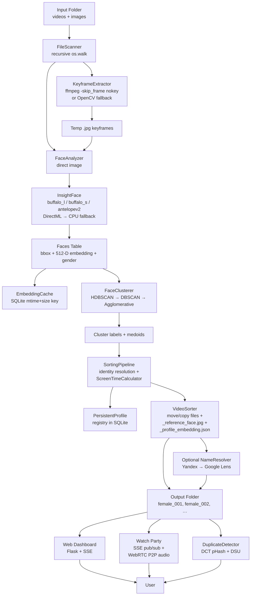

# AuraSort — System Documentation (Master Technical Reference)

> **Audience:** Engineers, integrators, and operators who need to understand exactly how AuraSort works at the code level.
> **Scope:** Every Python module, every HTTP route, every JS controller, every schema, every config knob.
> **Status:** Reverse-engineered from the current `master` branch.

---

## Table of Contents
1. [System Architecture Overview](#1-system-architecture-overview)
2. [In-Depth Module Analysis](#2-in-depth-module-analysis)
3. [Watch Party Synchronization & Real-time Network Architecture](#3-watch-party-synchronization--real-time-network-architecture)
4. [Schema & Data Storage Guide](#4-schema--data-storage-guide)
5. [Developer Operations & Deployment Guide](#5-developer-operations--deployment-guide)

---

## 1. System Architecture Overview

### 1.1 High-Level Data Flow



### 1.2 Process Topology

```
                    ┌─────────────────────────────────────────────┐
                    │  python app.py  (Werkzeug reloader on)      │
                    │                                             │
   Browser ───────► │  Flask app (port 5000)                      │
   dashboard        │   ├── /                                       │
   (Ctrl+K, hover,  │   ├── /api/*  (REST + SSE)                    │
   lightbox)        │   ├── /api/stream-progress  (SSE)             │
                    │   ├── /media/*  (send_from_directory)         │
                    │   ├── /watch-party/<id>  (Jinja2 SPA)         │
                    │   └── /api/watch-party/*  (SSE + REST)         │
                    │                                             │
                    │  pipeline_state (dict) ←─ progress_cb          │
                    │  watch_parties_state[pid] (dict of queues)    │
                    │  ui_log_handler.logs (≤500 ring buffer)       │
                    │                                             │
                    │  Background threads (daemon=True):            │
                    │   ├── run_pipeline_thread  (local fallback)   │
                    │   ├── monitor_parent_process  (Win)          │
                    │   ├── start_localhost_run_tunnel  (SSH)      │
                    │   ├── DuplicateDetector._thread              │
                    │   └── LibraryIndexer._thread                  │
                    │                                             │
                    │  Optional: Celery worker via Redis           │
                    │  (tasks.run_sorting_task)                    │
                    │                                             │
                    └─────────────────────────────────────────────┘
                                       │
                                       ▼
                            SQLite  /  Postgres
                            .cache/face_embeddings_cache.db
```

### 1.3 Repository Folder Walkthrough

| Path | Role |
| --- | --- |
| `app.py` (~2,700 LOC) | Flask entry point. Loads `Config`, instantiates the SQLAlchemy `db`, wires all routes, starts the SSH-tunnel and parent-monitor threads, handles signal-based cleanup. |
| `pipeline.py` (~550 LOC) | `SortingPipeline` orchestrator. Owns the multi-stage progress callback and stitches the modules together into one full run. |
| `config.py` | `Config` `@dataclass` with all 22 tunable parameters (paths, model pack, thresholds, limits, player choice). |
| `settings.json` | Persisted form of `Config`. Written by `app.save_settings`, read by `app.load_settings` on startup. |
| `tasks.py` | Optional Celery task. Imports `SortingPipeline` and reports progress via `self.update_state(state='PROGRESS', meta=…)`. |
| `verify_setup.py` | One-shot health check: import sanity, ffmpeg presence (incl. WinGet fallback), DirectML provider availability. |
| `modules/` | Pure-Python AI library (no Flask imports). Reusable from any host. |
| ├─ `scanner.py` | `FileScanner.scan() -> {videos:[], images:[]}` |
| ├─ `keyframe_extractor.py` | `KeyframeExtractor.extract_keyframes()` with FFmpeg (GPU & CPU) + OpenCV fallback |
| ├─ `face_analyzer.py` | `FaceAnalyzer.initialize()` + `analyze_image()` returning `{bbox, embedding, gender, gender_score, frame_index}` |
| ├─ `clustering.py` | `FaceClusterer.cluster_embeddings()` (HDBSCAN→DBSCAN→Agglomerative) + `find_cluster_medoids()` |
| ├─ `screen_time.py` | `ScreenTimeCalculator.calculate_assignments()` for per-file primary-identity assignment |
| ├─ `sorter.py` | `VideoSorter.sort_files()` for actual disk I/O and avatar cropping |
| ├─ `name_resolver.py` | `FilenameParser` + `ReverseImageSearcher` (Yandex→Google Lens) + `NameResolver.resolve_all_folders()` + `merge_folders_manual()` |
| ├─ `duplicate_detector.py` | `DuplicateDetector` singleton with background-threaded DCT pHash scan + DSU grouping |
| └─ `profile_manager.py` | `LibraryIndexer` background thread, `auto_extract_avatar()`, `get_profile_media()` |
| `utils/` | Cross-cutting infra. |
| ├─ `models.py` | SQLAlchemy models: `ProcessedFile`, `Face`, `PersistentProfile`, `WatchHistory`, `WatchParty` |
| ├─ `cache.py` | `EmbeddingCache` thin facade over the models. All read/write of face embeddings goes through here. |
| └─ `logger.py` | `UILogHandler` (ring buffer for the dashboard console) + `setup_logger()` (stdout + UI dual sink). |
| `templates/` | Jinja2 HTML. |
| ├─ `index.html` (~825 LOC) | Dashboard SPA shell. Sidebar, library, profile manager, gallery, pipeline, duplicates, configuration, lightbox, search modal, watch-party creation modal. |
| └─ `watch_party.html` (~850 LOC) | Standalone watch-party viewer. Header, video pane, playlist, sidebar (mic/chat/participants), password modal, nickname modal, folder switcher, admin panel, kick/ended modals, toasts. All styling inlined. |
| `static/css/style.css` (~2,500 LOC) | AuraSort design system: design tokens, glows, glass cards, buttons, sliders, switches, modals, lightbox, watch-party table styles. |
| `static/js/app.js` (~3,500 LOC) | Core dashboard controller (section nav, library grid, profile grid, lightbox, search modal, SSE progress, hover previews, toast). |
| `static/js/watch_party.js` (~1,340 LOC) | Standalone watch-party controller (auth flow, WebRTC mesh, SSE pub/sub, chat, admin panel). |
| `input/` | Default input directory (created on first launch). |
| `output/` | Default output directory. |
| `.cache/` | Embeddings DB, video thumbnails, duplicate scan JSON, transient keyframes. |
| `.temp_keyframes/` | Per-video `frame_NNNN.jpg` files (or persisted if `keep_keyframes=True`). |
| `__pycache__/`, `scratch/`, `*.html`/`*.txt` residue | Local artifacts; ignored. |

---

## 2. In-Depth Module Analysis

### 2.1 `modules/scanner.py` — File Discovery

**Algorithm:** Plain recursive walk via `os.walk(self.input_dir)`. For every file, `os.path.splitext(file)[1].lower()` is matched against:

```python
VIDEO_EXTENSIONS = {'.mp4', '.mkv', '.avi', '.mov', '.wmv', '.webm', '.flv', '.m4v', '.mpg', '.mpeg'}
IMAGE_EXTENSIONS = {'.jpg', '.jpeg', '.png', '.webp', '.bmp', '.tiff'}
```

All matches are normalized to absolute paths and partitioned into two lists. Case-insensitive thanks to `lower()`. **No MIME sniffing** is performed — extensions are trusted.

**Why a separate scanner?** It lets the pipeline start producing keyframes for videos in parallel with image analysis on the same run.

### 2.2 `modules/keyframe_extractor.py` — Smart Frame Sampling

The extractor does **scene-aware keyframe selection** by leaning on FFmpeg's `-skip_frame nokey` flag, which only decodes I-frames (the canonical "scene change" anchor in H.264/H.265 — the intra-coded frame at the start of each GOP).

#### 2.2.1 Entry point: `extract_keyframes(video_path) -> [{path, frame_index}]`

1. **Hash the path** (`md5(video_path).hexdigest()`) to create a stable per-video subfolder under `<workspace>/.temp_keyframes/<hash>/`. This makes the directory safe to garbage-collect independently per video.
2. **Debug re-use** — if `config.keep_keyframes == True` and the directory already contains `frame_NNNN.jpg` files, return them without re-running FFmpeg.
3. **FFmpeg path:**
   - Build `output_template = <video_temp_dir>/frame_%04d.jpg`.
   - Compute `duration` from `cv2.VideoCapture.get(CAP_PROP_FPS)` and `CAP_PROP_FRAME_COUNT`. If `extraction_percent < 100`, set `limit_duration = duration * (extraction_percent/100)` and pass `-t <limit_duration>` to FFmpeg.
   - **First attempt — GPU:** `cmd_gpu = ['ffmpeg', '-y', '-hwaccel', 'd3d11va', '-skip_frame', 'nokey', '-i', video_path, '-vsync', 'vfr', '-frame_pts', 'true', '-q:v', '2', output_template]`. `-vsync vfr` is critical — it tells FFmpeg not to duplicate frames to maintain the source framerate. `-frame_pts true` makes the output filenames reflect the source frame number.
   - **Fallback — CPU:** identical flags without `-hwaccel d3d11va`.
   - On Windows, both calls set `subprocess.STARTUPINFO().dwFlags |= subprocess.STARTF_USESHOWWINDOW` to suppress the console window.
   - Timeouts: 300 s (GPU) and 420 s (CPU).
4. **OpenCV fallback** (`_extract_with_opencv`):
   - `interval_sec = config.keyframe_interval if > 0 else 1.0`
   - `frame_step = max(1, int(fps * interval_sec))`
   - Loop reads frames, writes one per `frame_step` as JPEG quality 95, stops at `max_keyframes * 2` as a hard safety.
5. **Sub-sampling** — if the total keyframes exceed `config.max_keyframes`, the result is downsampled by even spacing and the dropped files are physically deleted.
6. **Cleanup** — `clean_temp_dir()` removes the global temp dir (unless `keep_keyframes`). `clean_video_temp(frames)` removes just one video's subfolder.

#### 2.2.2 FFmpeg Self-Discovery
`_find_ffmpeg()` first tries `ffmpeg` on `PATH`, then walks `LOCALAPPDATA\Microsoft\WinGet\Packages` recursively for `ffmpeg.exe`, prepends its directory to `PATH`, and returns the absolute path. The same routine is duplicated in `app.py` for `ffprobe`.

### 2.3 `modules/face_analyzer.py` — InsightFace Wrapper

#### 2.3.1 Model Packs
The `config.model_pack` parameter is one of `buffalo_l` (default), `buffalo_s` (fast), or `antelopev2` (best accuracy, slowest). These are InsightFace's published ONNX model bundles, each containing a RetinaFace detector, an ArcFace recognizer, and a gender/age head.

#### 2.3.2 `initialize()`
1. Sets `providers = ['DmlExecutionProvider', 'CPUExecutionProvider']`.
2. Creates `FaceAnalysis(name=model_pack, allowed_modules=['detection', 'recognition', 'genderage'], providers=providers)`.
3. `self.app.prepare(ctx_id=0, det_size=(640, 640))` — `ctx_id=0` selects the first GPU in DirectML's adapter list.
4. If the GPU prepare throws (`onxxruntime`, `device`, `suspended`, … in the error string), `fallback_to_cpu()` re-creates the analyzer with `providers=['CPUExecutionProvider']` and `ctx_id=-1` (CPU). This self-heal is repeated inside `analyze_image()` on every per-image error so a single bad frame does not poison the rest of the run.

#### 2.3.3 `analyze_image(path, frame_index=0) -> [face_dict, ...]`

```python
faces = self.app.get(img)  # cv2.imread + InsightFace batch inference
```

If `faces` is empty, a **padded-canvas fallback** embeds the image into a square `2 * max(h,w)` canvas (the image is centered, the rest is `np.zeros`), re-runs inference, and then translates the bboxes and `kps` (keypoints) back into the original coordinate space via stored `x_offset` / `y_offset`. This recovers extreme close-ups that RetinaFace misses because the face occupies the entire frame.

**Per-face filters** (in order):
1. **Size** — drops if `width < config.min_face_size` or `height < config.min_face_size`. Default 60 px.
2. **Detection confidence** — drops if `face.det_score < config.face_det_threshold` (0.30–0.90, default 0.50).
3. **Eye-distance / profile filter** — when `face.kps` (5 keypoints: left/right eye, nose, mouth corners) is available, computes `eye_dist = ||kps[0] - kps[1]||` and the ratio `eye_dist / width`. If the ratio is below `config.min_eye_dist_ratio` (0.00–0.30, default 0.20), the face is dropped. This is the "kissing scenes and side profiles" filter — when faces overlap or are at >60° yaw, the inter-ocular distance shrinks faster than the face width.
4. **Gender mapping** — InsightFace returns `face.gender` as `0` (female) or `1` (male). The code does `is_female = (face.gender == 0)`. If `gender` is a string it falls back to substring match `'f' in str(gender).lower()`. The label is `gender_label = 'female' if is_female else 'male'`. (Note: `gender_score` is currently the `det_score` proxy — the code does not yet have a separate gender-confidence channel.)
5. **Embedding** — uses `face.normed_embedding` (pre-normalized 512-D ArcFace vector) if present. Otherwise takes `face.embedding` and L2-normalizes it manually (`embedding / np.linalg.norm(embedding)`). Either way the result is unit-length, which is what the cosine-distance based clustering expects.

#### 2.3.4 Bbox
`bbox = face.bbox.astype(int)` — RetinaFace's natural format. Stored as `bbox.tolist()` → `[x1, y1, x2, y2]`.

### 2.4 `modules/clustering.py` — Embedding → Identity

#### 2.4.1 Distance Metric

All three candidate algorithms use **Euclidean distance on L2-normalized embeddings**. Because the embeddings are unit-length, Euclidean distance and cosine distance are bijectively related:

$$d_\text{euclid} = \sqrt{2 - 2 \cos\theta}$$

The pipeline never operates on cosine directly; `cluster_epsilon` is interpreted as the Euclidean cutoff.

#### 2.4.2 `cluster_embeddings(embeddings) -> labels`
- **Normalize** again (defensive): `norms = np.linalg.norm(emb_matrix, axis=1, keepdims=True); norms[norms == 0] = 1.0; emb_matrix = emb_matrix / norms`.
- **Guard** — if `num_samples < config.min_cluster_size`, return all-noise `[-1] * num_samples` (no clusters possible).
- **Algorithm cascade** (each fallback runs only if the previous failed):
  1. **HDBSCAN** with `min_cluster_size = config.min_cluster_size`, `min_samples = 1`, `cluster_selection_epsilon = config.cluster_epsilon`, `metric = 'euclidean'`. `min_samples=1` is intentional — in HDBSCAN `min_samples` controls how conservative the density estimate is; setting it to 1 lets small but cohesive groups survive.
  2. **DBSCAN** with `eps = config.cluster_epsilon`, `min_samples = min_cluster_size`, `metric = 'euclidean'`.
  3. **AgglomerativeClustering** with `n_clusters = None`, `distance_threshold = config.cluster_epsilon`, `metric = 'euclidean'`, `linkage = 'average'`.
- The final fallback to Agglomerative ensures clustering never fails as long as sklearn imports.
- **Noise label** = `-1`.

#### 2.4.3 `find_cluster_medoids(embeddings, labels) -> {cluster_id: medoid_index}`

For each non-noise cluster:
- Compute the intra-cluster dot product matrix `D[i,j] = clip(emb_i · emb_j, -1, 1)`.
- Convert to Euclidean: `dist = sqrt(max(0, 2 - 2D))`. The `max(0, …)` clamp guards against floating-point drift giving a tiny negative inside the square root.
- The medoid is the point that minimizes the **sum of distances to all other points** in the cluster (classic medoid objective).
- A single-member cluster's medoid is itself.

The medoid is later used as the **representative face** — its image becomes the folder's `_reference_face.jpg`.

#### 2.4.4 Why Euclidean on Unit Vectors?
ArcFace's `normed_embedding` is already on the unit hypersphere. Using Euclidean is computationally cheaper (no `arccos` per pair) and monotonic with cosine, so threshold tuning is equivalent. The medoid objective also avoids the centroid (mean) bias that occurs when one cluster has outliers — the medoid is a real sample.

### 2.5 `modules/sorter.py` — File Movement, Avatar, Profile JSON

`sorted_clusters = sorted(unique_clusters excluding -1)`.

**For each cluster, before moving any files:**
1. Resolve a folder name — either the one pre-assigned by `SortingPipeline` (e.g. `female_007` or a Yandex-resolved name) or `female_{cluster_id+1:03d}`, with collision avoidance.
2. `os.makedirs(cluster_dir, exist_ok=True)`.
3. **Save `_profile_embedding.json`** with `{profile_id, folder_name, embedding: list}`. If a fresh `profile_id` is required it is created via `cache_ref.add_persistent_profile(folder_name, emb)`; this is the row that lands in `persistent_profiles`.
4. **Save `_reference_face.jpg`** by reading the medoid's source image / keyframe, applying a 20 % pad around the bbox, and writing JPEG quality 95.

**For each `(file_path, cluster_id)` assignment:**
- If `cluster_id == -1`, target = `<out>/_unsorted/`. Otherwise the cluster's folder.
- **Collision handling** — if `<base>.<ext>` exists, append `_1`, `_2`, … until unique.
- `mode == "move"` → `shutil.move` and `cache_ref.update_file_path(src, dest)`. `mode == "copy"` → `shutil.copy2` and `cache_ref.copy_file_cache(src, dest)`.
- A `report` dict is filled with `{src_path: {dest, cluster}}` or `unsorted_files.append(src_path)`.
- At the end, `_sorting_report.json` is dumped alongside the folders.

### 2.6 `modules/profile_manager.py` — Library Indexer, Avatar Auto-Extract, Cross-Folder Profile Media

#### 2.6.1 `LibraryIndexer.start_indexing(app, cache_db, config)`

A singleton with `cls._lock` + `cls._thread`. State is a class-level dict:
```python
state = {'running': False, 'total_files': 0, 'processed_files': 0, 'current_file': 'Idle', 'percent': 0.0}
```

The thread:
1. Enumerates every file in `output_dir` (skipping `_`-prefixed metadata files).
2. For each, asks `cache_db.get_cached_faces(file_path)` — if cached, skip.
3. Otherwise, calls `analyzer.analyze_image()` (for images) or `extractor.extract_keyframes()` → loop `analyzer.analyze_image()` (for videos). Each keyframe inference is followed by `time.sleep(0.015)` (the same TDR-protection trick used by the main pipeline).
4. Writes results back via `cache_db.cache_faces()`.

The state dict is polled by `/api/profiles/index/status` to drive the dashboard's indexer progress bar.

#### 2.6.2 `auto_extract_avatar(folder_name, cache_db, config, analyzer=None, force=False)`

The single most subtle function in the codebase. It picks the **best face** to display as a folder's avatar, prioritizing visible, well-framed, high-confidence faces that match the cluster's profile embedding.

**Steps:**

1. **Read profile embedding** from `_profile_embedding.json` if present.
2. Enumerate all media files in the folder (non-`_`).
3. Temporarily override the analyzer config: `min_eye_dist_ratio=0.05`, `face_det_threshold=0.45` — the avatar picker is **deliberately more permissive** than the pipeline so it does not miss good candidates.
4. **First pass** — for every file, get cached faces (or analyze on the fly for videos by sampling 4 frames at `[0, 25 %, 50 %, 75 %]`). For every face:
   - If a profile embedding exists, compute L2 distance. Faces with `dist > 1.15` (very lenient) are dropped.
   - **Cut-off check** — `is_cutoff = (x1 < -pad_w) or (y1 < -pad_h) or (x2 > w + pad_w) or (y2 > h + pad_h)` with `pad = 5 %` of face size. Cut-off faces get `effective_score = score - 0.5`.
   - The best is tracked as `(best_face, best_score, best_file_path)`.
5. **Fallback pass** — if no face matched the lenient threshold but a profile embedding exists, do an "absolute closest face" pass: ignore the 1.15 cutoff and minimize `effective_dist = dist + (0.5 if is_cutoff else 0)`.
6. **Crop & save** — read the image (or seek the video via `cv2.VideoCapture.set(CAP_PROP_POS_FRAMES, frame_index)`), apply 20 % pad, write `_reference_face.jpg` at quality 95.
7. **Final fallback** — if no face could be picked, copy the first image in the folder, or extract the first frame of the first video, into `_reference_face.jpg`. This guarantees a thumbnail is always available.

`get_profile_media(folder_name, cache_db, config)` returns a deduplicated list of every media file (i) physically inside the folder and (ii) that has at least one face within `config.cluster_epsilon` of the folder's profile embedding (queried by streaming the `Face` table and computing `np.linalg.norm`). This is what powers the cross-folder "all media for this profile" view in the gallery and the Watch Party playlist.

### 2.7 `modules/screen_time.py` — Primary-Identity Assignment

After clustering returns `(embedding, cluster_label)` for each face, every file may have multiple faces. The question: *which cluster owns the file?*

**Algorithm (`calculate_assignments(file_faces_map, face_id_to_cluster)`):**

1. For each file, build:
   - `clusters` — the set of distinct cluster IDs (excluding noise) that appear.
   - `occurrences` — `{cluster_id: set(frame_indices)}`.
   - `first_seen_order` — list of cluster IDs in the order they first appeared.
2. Compute `global_popularity[cluster_id]` = how many files that cluster appears in.
3. **For each file:**
   - `cluster_counts = {cid: len(frames)}` — how many keyframes that cluster owns in the file.
   - If `config.prefer_popular_identities == True` **and** `len(clusters) >= 2`: pick the cluster with the highest `global_popularity`. Ties broken by the same screen-time rule.
   - Else: pick the cluster with the highest `cluster_counts` (the most keyframes).
   - Ties broken by `min(candidates, key=lambda c: first_seen_order.index(c))` — i.e. the cluster that appeared **earliest in the video**.

`prefer_popular_identities` is a heuristic to deal with the "boyfriend cameo in a girlfriend-themed video" problem — the GF who appears across 50 videos should win a 1-occurrence cameo by the BF in a single file.

### 2.8 `pipeline.py` — The Orchestrator

`SortingPipeline.run()` walks the entire state machine in eight steps, with progress percentages 5–100:

| Stage | % | Action |
| --- | --- | --- |
| `scanning` | 5–10 | `FileScanner.scan()` |
| `init_models` | 15 | `FaceAnalyzer.initialize()` |
| `analysis` (images) | 15–75 (proportional) | per-image `analyze_image()` + `cache_faces()` |
| `analysis` (videos) | same window | `ThreadPoolExecutor(max_workers=4)` over `process_video` (each holds `gpu_lock` and `time.sleep(0.015)` between keyframes) |
| `clustering` | 80 | `FaceClusterer.cluster_embeddings(female_only)` |
| (implicit) | — | `_load_and_sync_profiles()` — sync DB ↔ disk |
| `assignment` | 85 | `ScreenTimeCalculator.calculate_assignments()` |
| `sorting` | 90 | `VideoSorter.sort_files()` |
| `auto_naming` | 92–99 | optional `NameResolver.resolve_all_folders()` |
| `completed` | 100 | `extractor.clean_temp_dir()` |

**Profile sync** (`_load_and_sync_profiles`) is the heart of the "no re-clustering across runs" property:
- Case A — both DB and disk have the profile, but folder names differ → user manually renamed the folder on disk. The pipeline updates the DB row and every `ProcessedFile.file_path` that starts with the old prefix.
- Case B — only on disk (DB was cleared / folder copied) → import into DB with the original `profile_id`.
- Case C — on disk but no `profile_id` (legacy folders) → match to the closest existing profile by L2 distance with `epsilon=0.05` (very strict) and re-write the JSON with the matched ID. Otherwise create a new ID and DB row.

**Medoid frame re-extraction** — if a medoid's `keyframe_path` is missing (because the run was cached and the temp folder was cleaned), `cv2.VideoCapture.set(CAP_PROP_POS_FRAMES, frame_index)` reads the exact source frame and saves it under `.temp_keyframes/medoids/medoid_c<id>.jpg`. Images are trivially the source itself.

### 2.9 `modules/name_resolver.py` — Auto-Naming

#### 2.9.1 `FilenameParser`
- Lower-cases, replaces `[_.\-\s+]+` with a single space, splits CamelCase with `re.sub(r'(?<!^)(?=[A-Z][a-z])', ' ', name)`.
- Splits on whitespace, drops tokens of length ≤ 1 and tokens in `NON_NAME_WORDS` (a curated blocklist of file formats, site names, English stop words, etc. — about 200 entries).
- Title-cases the survivors and returns the first 1–3 tokens. The blocklist is the difference between "Hazel Moore" and "4k Scarlett Johansson Interview With Pixels".

`extract_name_from_folder(folder_path)` returns `(name, confidence)` where confidence is a step function of `match_count / total_files` (1 match → 0.45, 2 matches with ratio ≥ 0.7 → 0.65, ≥ 5 with ratio ≥ 0.8 → 0.85, else 0.65–0.75).

#### 2.9.2 `ReverseImageSearcher`
**Yandex first** (more reliable, native Python):
- POST `https://yandex.com/images/search?rpt=imageview&format=json&request={...}` with `upfile` multipart → JSON `cbirId`.
- GET `https://yandex.com/images/search?cbir_id=<id>&rpt=imageview` → HTML.
- Parse with BeautifulSoup: any element whose class contains `CbirTags`, `CbirSites-ItemTitle`, `button`, `link`, or `tag` becomes a candidate string.

**Google Lens fallback** (subprocess `curl`, bypasses TLS fingerprinting):
1. `curl -s -i -F encoded_image=@<path> https://lens.google.com/upload?hl=en` → scrape the `Location:` redirect URL.
2. `curl -s -L -H 'User-Agent: …' -H 'Accept: …' <redirect>` → results HTML.
3. Parse for `<a>` and `<span>` text. Reject pages that contain "Forbidden" or "403. That".

`find_name_in_candidates` extracts 1–3 token English name candidates per chunk, drops anything containing a blocklisted word, and picks the most-frequent. Confidence is a step function of `count` (≥ 6 matches → 0.8, ≥ 3 → 0.7, else 0.5).

**Cross-reference** in `resolve_folder_name`:
- If both filename-parser and search agree (fuzzy ratio ≥ 0.8) → return `search_name` with confidence `0.95` and source `"Cross-Referenced"`.
- If they disagree and search confidence is higher → return search (slight penalty).
- Otherwise return the filename name (slight penalty).

#### 2.9.3 `NameResolver.resolve_all_folders`
1. Scan `output_dir`, optionally restricting to `female_*` (`only_name_unnamed`).
2. For each folder, run the resolution → build a `conflict_map[target_path] -> [(src_path, conf, name, source), …]`.
3. Apply `time.sleep(config.name_search_delay)` between reverse searches (default 4 s) to avoid being rate-limited.
4. Conflict resolution:
   - **No conflict** → `os.rename`-equivalent via `_rename_and_update` (also updates `_profile_embedding.json` and SQLite).
   - **Conflict + `merge_on_name_conflict`** → average the embeddings, merge files, delete source folders.
   - **Conflict without merge** → suffix ` 2`, ` 3`, … to keep them separate.

#### 2.9.4 `merge_folders_manual(output_dir, folder_names, target_name)`
Used by both `/api/merge-folders` and `/api/profiles/merge`. Steps:
1. Validate every source folder exists; bail if fewer than 2 valid.
2. Pick a target name (user-provided or first source).
3. **Average all `profile_id` embeddings** → L2-normalize the mean → this is the merged profile's representative vector.
4. If the target name is new, rename the first source into the target (and update SQLite paths).
5. For each remaining source, move every non-`_` file to the target (with collision suffixes), update SQLite per moved file, then `shutil.rmtree` the source.
6. Write the averaged embedding into the target's `_profile_embedding.json` and call `cache.add_persistent_profile_with_id(target_id, target_name, merged_embedding)`.

### 2.10 `modules/duplicate_detector.py` — Perceptual Hash Scan

#### 2.10.1 Algorithm
- For each image, `compute_image_phash`:
  1. `cv2.imread(path, IMREAD_GRAYSCALE)` → 32 × 32 resize.
  2. `cv2.dct(np.float32(img))` → take the 8 × 8 top-left (low-frequency block).
  3. Compute the median of the 63 AC coefficients (everything except `dct[0,0]`).
  4. For each of the 64 coefficients, bit = `1 if dct_8x8[i] > median else 0`.
  5. Pack 64 bits into a 16-character hex string.

  This is the canonical **DCT-based pHash** (originally from Christoph Zauner). Unlike aHash (mean luminance) or dHash (gradient bits), pHash survives JPEG re-encoding, mild resizing, and minor color shifts because it depends on the **frequency-domain structure** of the image rather than raw pixels.

- For each video, `get_video_props_and_hash`:
  1. Open with `cv2.VideoCapture`, read the first frame.
  2. Run the same DCT pHash on the first frame (`32×32` grayscale).
  3. Capture `{duration, filesize, width, height, fps}`.

#### 2.10.2 Grouping via Disjoint-Set Union
For images: pairwise Hamming distance ≤ 10 across 64 bits → union. For videos: Hamming ≤ 10 **AND** `|Δduration| ≤ 3 s` → union (a true duplicate is a re-encode of the same content, not just the same poster).

After DSU is built, each set with ≥ 2 elements is a group. Each file gets a `quality_score = width * height * 10 + filesize` and is sorted descending; the top is flagged `is_best`. The results are cached to `.cache/duplicates.json`.

`get_cached_duplicates` re-validates every `path` still exists on disk before returning (de-duplicating if any were deleted externally), re-sorts by quality, and re-flags `is_best`. If the validated set is smaller than the cached one, the cache is rewritten.

---

## 3. Watch Party Synchronization & Real-time Network Architecture

### 3.1 Server: SSE Stream & In-Memory State

The room is a single dict in `app.py` named `watch_parties_state[party_id]` (keyed by the room UUID). Each entry is:

```python
{
    'admin_token': '<uuid>',
    'clients': {
        '<client_id>': {
            'name': '<nickname>',
            'queue': queue.Queue(),     # per-client mailbox
            'last_seen': <unix_ts>,
            'is_admin': <bool>,
        },
        ...
    },
    'playback_state': {
        'filename': '<current file or None>',
        'position': <float seconds>,
        'playing':  <bool>,
        'last_updated': <unix_ts>,
    },
    'playback_locked': False,
    'slow_mode': False,
    'kicked_clients': ['<client_id>', ...],
    'cooldowns': { '<client_id>': <last_chat_ts> }
}
```

The DB row in `watch_parties` mirrors only the **persistent** parts: `id`, `folder_name`, `password_hash`, `admin_token`, `expires_at`. The runtime queue and presence are memory-only (the server rehydrates the dict from the DB on first connect, then operates in memory).

#### 3.1.1 Connection Lifecycle: `GET /api/watch-party/<id>/stream`

Per-request query params: `client_id`, `client_name`, optional `admin_token`. The handler:
1. **Validates the party** — `WatchParty.query.get(party_id)`, refuses if missing or `expires_at < utcnow()`. Returns 404 / 403 as text for EventSource ergonomics.
2. **Refuses kicked clients** — if `client_id in party_state['kicked_clients']`, return 403.
3. **Detects admin** — if `admin_token` matches `party_state['admin_token']` (or, on first connect, `party.admin_token`), `is_admin = True`.
4. **Initializes state on first connect** — if the room isn't in `watch_parties_state` (server restart), rehydrates from the DB row.
5. **Registers the client** and broadcasts `peer_joined` to every other client.
6. **Pushes an `init` event** with the current `playback_state`, `playback_locked`, `slow_mode`, `is_admin`, and the list of existing peers.
7. **Generator loop** — every 2 s, `q.get(timeout=2.0)`. If empty, yields a heartbeat `data: {"type":"ping"}\n\n` to keep proxies / browsers from disconnecting. If a message is queued, yields it as `data: {json}\n\n`.
8. **Heartbeat housekeeping** — on every iteration, updates `last_seen` for this client.
9. **Cleanup on `GeneratorExit`** — deletes the client from `party_state['clients']` and broadcasts `peer_left`. The browser-side `EventSource.onerror` will cause a reconnect attempt; if the disconnect was deliberate (kick / end), the client explicitly closes the source and shows a modal.

**Event Types (the protocol):**

| Type | Direction | Payload | Trigger |
| --- | --- | --- | --- |
| `init` | server → new client | `{playback_state, playback_locked, slow_mode, is_admin, peers:[{client_id,name,is_admin}]}` | initial connect |
| `peer_joined` | server → others | `{client_id, name, is_admin}` | new client |
| `peer_left` | server → others | `{client_id, name}` | disconnect |
| `sync` | client → server (broadcast) | `{action:'play'\|'pause'\|'seek', position, filename, sender_id}` | play/pause/seek |
| `chat` | client → server (broadcast) | `{message_id, sender_id, sender_name, message, time, is_admin}` | chat send |
| `chat_delete` | server → all | `{message_id}` | admin deleted |
| `chat_clear` | server → all | `{}` | admin clear |
| `folder_changed` | server → all | `{folder_name, files, sender_id}` | admin switched folder |
| `playback_locked` | server → all | `{locked}` | admin toggled |
| `settings_changed` | server → all | `{slow_mode?, expires_at?}` | admin settings |
| `kicked` | server → target | `{}` | admin kicked target |
| `force_mute` | server → target | `{}` | admin muted target |
| `party_ended` | server → all | `{}` | admin ended |
| `signal` | client → server (relay) | `{sender_id, signal:{type,…}}` | WebRTC SDP/ICE relay |
| `ping` | server → client | `{}` | heartbeat |

#### 3.1.2 Sync Validation in `POST /api/watch-party/<id>/sync`
- If `playback_locked == True` and the sender is not admin → return `{status:'ignored'}` with no broadcast.
- Otherwise update the room's `playback_state` and push `sync` to every **other** client (the sender's `q` is skipped to prevent echo).

#### 3.1.3 Chat Validation in `POST /api/watch-party/<id>/chat`
- If `client_id` is in `kicked_clients` → 403.
- If `slow_mode == True` and the sender is not admin → check `now - cooldowns[client_id] < 10.0`; if so, return 429 with the remaining seconds; otherwise stamp `cooldowns[client_id] = now`.
- Push the message to every other client.

#### 3.1.4 Public-Tunnel Hardening
`@app.before_request` checks the `Host` header. If it matches `*.lhr.life` or `localhost.run`:
- Allow `/static/*`, `/watch-party/*`, `/api/watch-party/*`, `/media/*`, `/api/video-thumbnail/*`, `/api/thumbnail/*`, and `/api/profile/<folder>/media` **only if** that folder is currently being shared.
- Allow `/api/profiles` only with a valid `admin_token`.
- Everything else → 403. This means a random web visitor pointing at the tunnel URL cannot trigger sorting, change settings, or enumerate folders.

### 3.2 Client: `static/js/watch_party.js` — WebRTC + SSE Mesh

#### 3.2.1 Authentication Flow
`initAuthFlow()` first tries `POST /api/watch-party/<id>/auth` with the (possibly empty) `partyPassword` retrieved from `sessionStorage`. If 200 → nickname modal. If 401 → password modal first. The password modal re-uses the same `checkAuth` until success, then `sessionStorage.setItem('wp_password_<id>', password)`.

#### 3.2.2 Microphone Capture
After nickname submit, `navigator.mediaDevices.getUserMedia({ audio: true })` is requested. The track is `enabled = false` immediately so the local mic is muted on entry (no accidental audio). The mic button toggles `track.enabled`. If the user denies, the controller falls back to listen-only mode (button disabled, status text "Listen only").

#### 3.2.3 SSE Subscription
`new EventSource('/api/watch-party/<id>/stream?client_id=…&client_name=…&admin_token=…')` — `admin_token` is read from `localStorage.wp_admin_token_<id>` and included if the user is the host. Each `onmessage` is JSON-parsed; `data.type === 'ping'` is a no-op (heartbeat). All other types flow into `handleSSEMessage(data)` which has a giant `switch` that maps the type to a local action.

#### 3.2.4 WebRTC P2P Audio Mesh

**Topology:** full mesh. Every client opens one `RTCPeerConnection` per other client. For a 4-person room there are 6 connections. The room size is intentionally limited by this — for ≤ 8 participants it scales fine.

**STUN servers** (in `rtcConfig.iceServers`):
```js
[
  { urls: 'stun:stun.l.google.com:19302' },
  { urls: 'stun:stun1.l.google.com:19302' },
  { urls: 'stun:stun2.l.google.com:19302' }
]
```
No TURN is configured. This means the connection works as long as both peers can be reached directly by STUN-discovered IP. Behind symmetric NATs the audio will fail silently.

**Initiator vs answerer:**
- When `peer_joined` arrives, the **existing** client calls `createPeerConnection(peerId, isInitiator=true)` and sends an offer.
- The new client, on receiving the offer, calls `createPeerConnection(peerId, isInitiator=false)` and replies with an answer.
- The PC's `onicecandidate` handler sends every discovered candidate to the other side via the `signal` channel.
- `pc.ontrack` attaches the remote audio to a hidden `<audio>` element and starts an `AnalyserNode` VU monitor for the speaking indicator.

**ICE candidate queueing (polite peer):**
`handleIncomingSignal` always assumes the *receiver* may not yet have a remote description set (because SDP and ICE trickle in unpredictable order). Candidates that arrive before `setRemoteDescription` are pushed into `iceCandidateQueues[peerId]` and drained by `processIceQueue` after the description is set. This is the **"polite peer" pattern** simplified for 1:1 calls — no glare handling is needed because there's no simultaneous offer/answer.

**Speech level detection (VAD-lite):**
`monitorStreamStream(stream, peerId)`:
1. Creates a `MediaStreamAudioSourceNode` from the remote stream.
2. Pipes it through an `AnalyserNode(fftSize=256)`.
3. Every 120 ms reads `getByteFrequencyData` and computes the mean of the 128 frequency bins.
4. If the mean > 12, the green `speaking` class is added to `#voice-<peerId>`; otherwise it falls back to the red `muted` class.
5. The 12 threshold is a heuristic chosen for 8 kHz voice fundamental on a 44.1 kHz stream — it's intentionally low to catch quiet speech.

**Cleanup:**
On `peer_left` or hangup, the PC is `.close()`d, the remote audio is removed, and `iceCandidateQueues[peerId]` is deleted.

#### 3.2.5 Playback Sync

`player` is a Plyr instance bound to `#lightbox-video`. The `play` / `pause` / `seeked` events on Plyr are intercepted:

```js
player.on('play',  () => broadcastSync('play',  player.currentTime));
player.on('pause', () => broadcastSync('pause', player.currentTime));
player.on('seeked',() => broadcastSync('seek',  player.currentTime));
```

A boolean `ignorePlayerEvents` flag is set to `true` for 500 ms around any local change triggered by an incoming sync, to prevent echoing. If `isPlaybackLocked` is true and the user is not admin, the local action is reverted and a warning toast is shown.

**Receiving a sync (`handleIncomingSync(action, position, filename)`):**
1. If `filename !== currentFilename`, `loadMediaFile(filename)` first.
2. For videos: if `|player.currentTime - position| > 2.0`, snap to `position` (the 2 s tolerance avoids visible re-sync on every micro-drift).
3. Call `player.play()` or `player.pause()` based on the action.
4. Reset `ignorePlayerEvents = false` after 500 ms.

**Playlist UI:** A 16:9 grid; click sends `loadMediaFile(filename).then(() => broadcastSync('pause', 0.0))` so the room starts paused at the new file's beginning.

**Admin folder change:** `POST /api/watch-party/<id>/change-folder` updates the DB and broadcasts `folder_changed`. All clients swap `window.FOLDER_NAME`, re-render the playlist, and load the first file paused at 0.0.

### 3.3 Admin Moderation Surface

| Action | Endpoint | Effect |
| --- | --- | --- |
| Kick | `POST /api/watch-party/<id>/kick` | `kicked_clients.append(client_id)`; push `kicked` to target's queue; target closes SSE + all PCs. |
| Force mute | `POST /api/watch-party/<id>/force-mute` | Push `force_mute`; target sets `localStream.getAudioTracks()[0].enabled = false` and shows a yellow toast. |
| Playback lock | `POST /api/watch-party/<id>/playback-lock` | Flip `playback_locked`; broadcast `playback_locked`. Non-admin local actions are reverted. |
| Slow mode (chat) | `POST /api/watch-party/<id>/settings` with `{slow_mode}` | Flip `slow_mode`; broadcast `settings_changed`; non-admins see 10 s cooldown in their input. |
| Delete message | `POST /api/watch-party/<id>/delete-message` | Broadcast `chat_delete`; clients `removeChild` the matching `<div id="chat-msg-<id>">`. |
| Clear chat | `POST /api/watch-party/<id>/settings` with `{clear_chat: true}` | Broadcast `chat_clear`; clients wipe the chat container. |
| Set / remove password | `POST /api/watch-party/<id>/settings` with `{password}` | SHA-256 stored in DB; future joins must `auth` first. |
| Extend expiry | `POST /api/watch-party/<id>/extend` | `expires_at += hours`; broadcast `settings_changed` with new `expires_at`. |
| End party | `POST /api/watch-party/<id>/end` | `expires_at = now - 1s`; broadcast `party_ended`; clients show "Session Ended" modal. |

### 3.4 Public Sharing via localhost.run

`start_localhost_run_tunnel()` launches an SSH subprocess: `ssh -o StrictHostKeyChecking=no -R 80:127.0.0.1:5000 nokey@localhost.run`. Its stdout is line-buffered; a regex `r'(https://[a-zA-Z0-9-]+\.lhr\.life)'` captures the public URL into `public_tunnel_url`. On Windows, the subprocess is attached to a **Job Object** with `JOB_OBJECT_LIMIT_KILL_ON_JOB_CLOSE` via `ctypes.windll.kernel32.CreateJobObjectW / SetInformationJobObject / AssignProcessToJobObject`. When the Flask process exits, `cleanup_tunnel()` calls `CloseHandle` on the job, which **terminates the tunnel subprocess automatically**. This is registered as `atexit`, as a `SIGINT`/`SIGTERM` handler, and as a Windows `SetConsoleCtrlHandler` callback so Ctrl+C, terminal close, and process exit all trigger the same teardown. `monitor_parent_process()` runs in a daemon thread under `WERKZEUG_RUN_MAIN=true` and uses `WaitForSingleObject(ppid, 1000)` to detect a parent (reloader) exit and shut down the child immediately.

---

## 4. Schema & Data Storage Guide

### 4.1 SQLAlchemy Models (`utils/models.py`)

```python
db = SQLAlchemy()  # init_app(app)
```

Boot-time setup in `app.py`:
- `DATABASE_URL` env var → Postgres; else `sqlite:///<workspace>/.cache/face_embeddings_cache.db`.
- `db.create_all()` — idempotent schema creation.
- `inspect(engine).get_columns('watch_history')` → if `rating` is missing, `ALTER TABLE watch_history ADD COLUMN rating INTEGER`.
- `inspect(engine).get_columns('watch_parties')` → if `admin_token` is missing, `ALTER TABLE watch_parties ADD COLUMN admin_token VARCHAR(255)`.
- This means the schema is **forward-migrating** without Alembic — the boot always repairs old DBs.

#### 4.1.1 `processed_files` (cache key)
| Col | Type | Default | Note |
| --- | --- | --- | --- |
| `id` | Integer PK | autoinc | |
| `file_path` | String UNIQUE | — | absolute path; used as the cache key |
| `file_type` | String | None | `'video'` or `'image'` |
| `mtime` | Float | None | seconds since epoch at analysis time |
| `size` | BigInteger | None | bytes |
| `processed_time` | DateTime | utcnow | |
| `faces` | relationship | — | `cascade='all, delete-orphan'` |

#### 4.1.2 `faces`
| Col | Type | Default | Note |
| --- | --- | --- | --- |
| `id` | Integer PK | autoinc | |
| `file_id` | Integer FK→`processed_files.id` ON DELETE CASCADE | — | |
| `frame_index` | Integer | None | |
| `bbox_json` | Text | None | JSON `[x1,y1,x2,y2]` |
| `gender` | String | None | `'female'` or `'male'` |
| `gender_score` | Float | None | currently `det_score` proxy |
| `embedding_blob` | LargeBinary | None | `np.float32.tobytes()` (512-D) |

#### 4.1.3 `persistent_profiles`
| Col | Type | Default | Note |
| --- | --- | --- | --- |
| `id` | Integer PK | autoinc | stable across re-runs, mirrored into `_profile_embedding.json` |
| `folder_name` | String | None | current on-disk folder name (kept in sync with manual renames) |
| `embedding_blob` | LargeBinary | None | representative (medoid) embedding |
| `last_updated` | DateTime | utcnow (onupdate) | |

#### 4.1.4 `watch_history`
| Col | Type | Default | Note |
| --- | --- | --- | --- |
| `id` | Integer PK | autoinc | |
| `file_path` | String UNIQUE | — | relative `folder_name/filename` |
| `playback_position` | Float | 0.0 | seconds |
| `duration` | Float | 0.0 | seconds |
| `watched_at` | DateTime | utcnow (onupdate) | |
| `is_completed` | Boolean | False | true if `position / duration >= 0.90` |
| `rating` | Integer | None | 1–5; added by ALTER on boot |

#### 4.1.5 `watch_parties`
| Col | Type | Default | Note |
| --- | --- | --- | --- |
| `id` | String(36) PK | — | UUID4 (the room slug) |
| `folder_name` | String(255) | — | shared identity folder |
| `password_hash` | String(255) | None | `sha256(password).hexdigest()`; null = open room |
| `admin_token` | String(255) | None | UUID4; added by ALTER on boot |
| `created_at` | DateTime | utcnow | |
| `expires_at` | DateTime | — | `utcnow() + 24h` at creation; extendable |

### 4.2 The `EmbeddingCache` Layer (`utils/cache.py`)

`EmbeddingCache` is the **only sanctioned way** to read or write face data; the modules never touch SQLAlchemy directly.

**Cache invalidation** (`get_cached_faces(file_path)`):
- `mtime, size = os.stat(file_path)` — current filesystem signature.
- Look up `ProcessedFile.file_path == file_path`.
- If `abs(processed_file.mtime - mtime) > 0.01` **or** `processed_file.size != size` → the file changed since last analysis. Delete the row (and its `Face` rows via cascade) and return `None` (forcing a re-analysis).
- Otherwise return a list of face dicts with `np.frombuffer(face.embedding_blob, dtype=np.float32)` rehydrating the embedding.

**Why mtime+size and not hash?** Hashing every file on every run would dwarf the cost of running InsightFace. mtime+size is correct in 99.9 % of cases (InsightFace is the only consumer); the user can always "Clear Cache" to force a full re-analysis.

**Cache write** (`cache_faces(file_path, file_type, faces_data)`):
1. Delete any existing `ProcessedFile` for this path.
2. Insert a fresh `ProcessedFile` row.
3. `db.session.flush()` to populate the `id` for the foreign key.
4. Insert a `Face` per face with `embedding.astype(np.float32).tobytes()`.

**Profile operations:**
- `add_persistent_profile(folder, emb)` → returns the new `profile_id`.
- `add_persistent_profile_with_id(id, folder, emb)` → upsert by ID.
- `update_profile_folder_name(id, name)` → rename in DB only (no disk).
- `update_profile_folder_name_by_old_name(old, new)` → bulk rename.
- `delete_persistent_profile(id)` → used by merges and `auto_extract_avatar` cleanups.

**Path migrations:**
- `update_file_path(old, new)` — single row.
- `update_folder_paths(old_dir, new_dir)` — bulk string-replace of the prefix in `file_path`.
- `copy_file_cache(src, dst)` — clones the `ProcessedFile` and every `Face` (with the same bytes); used by `mode == 'copy'` to keep the cache consistent.

**Tie-in to sort/merge logic:**
Every file move / folder rename / merge calls one of these methods. The pipeline never lets the on-disk state drift from the DB.

---

## 5. Developer Operations & Deployment Guide

### 5.1 Setup

#### 5.1.1 Prerequisites
1. **Python 3.10+** (uses modern type hints and union syntax).
2. **FFmpeg** + **ffprobe** on `PATH` (or discoverable in `%LOCALAPPDATA%\Microsoft\WinGet\Packages` on Windows). The extractor needs `d3d11va` hwaccel for GPU decode; CPU decode works without it.
3. **Optional:** a DirectML-capable GPU (AMD / Intel / NVIDIA). The `onnxruntime-directml` package brings it; if it's missing, InsightFace falls back to CPU.

#### 5.1.2 `requirements.txt`
```
numpy
opencv-python
insightface
onnxruntime-directml
scikit-learn
Flask
Flask-SQLAlchemy
psycopg2-binary
celery
redis
tenacity
flask-cors
pytest
```

The `requirements.txt` is intentionally lean — `beautifulsoup4` and `requests` (used by `name_resolver.py`) are pulled in transitively. If you fork, pin them explicitly.

#### 5.1.3 First-Run Verification
`python verify_setup.py` runs three checks:
1. Imports of `flask, numpy, cv2, sklearn, flask_sqlalchemy, psycopg2, tenacity, insightface, onnxruntime`.
2. `ffmpeg -version` (with the WinGet fallback). Prints the first line of stdout on success.
3. `onnxruntime.get_available_providers()` — confirms `DmlExecutionProvider` is listed.

#### 5.1.4 Launch
```bash
python app.py
```
Werkzeug runs in debug mode (auto-reload). The reloader spawns a child that:
- Initializes the SQLite DB (or ALTERs the existing one).
- Starts the localhost.run SSH tunnel (opt-out by setting `WERKZEUG_RUN_MAIN=true` and removing the `start_localhost_run_tunnel` call).
- Mounts a parent-monitor thread on Windows that kills the child if the parent dies.
- Serves on `127.0.0.1:5000`.

Open `http://127.0.0.1:5000/`.

### 5.2 Configuration Reference

`config.py` is the single source of truth. `app.py` mirrors it to/from `settings.json` on every save. Defaults:

| Key | Default | Effect |
| --- | --- | --- |
| `input_dir` | `''` | Source of media. Subdirectories are walked recursively. |
| `output_dir` | `''` | Where sorted folders appear. |
| `mode` | `'move'` | `'move'` deletes the source; `'copy'` keeps it. |
| `keyframe_interval` | `0` | `0` = I-frames only (FFmpeg `-skip_frame nokey`). `>0` = OpenCV samples every N seconds. |
| `max_keyframes` | `100` | Safety cap per video. If exceeded, frames are evenly sub-sampled. |
| `model_pack` | `'buffalo_l'` | InsightFace model. `buffalo_s` is faster; `antelopev2` is more accurate. |
| `face_det_threshold` | `0.5` | RetinaFace confidence floor. Lower = more faces (more noise). |
| `gender_threshold` | `0.65` | Currently unused as a numeric gate (only the binary `gender==0` test is applied), but reserved for a future `gender_score >= threshold` filter. |
| `min_face_size` | `60` | Drops faces smaller than this in either dimension. |
| `min_eye_dist_ratio` | `0.20` | Eye-distance / face-width floor. Higher = more aggressive profile/kissing filter. `0.0` disables. |
| `min_cluster_size` | `2` | Min faces per cluster (HDBSCAN / DBSCAN). Single-face clusters become noise. |
| `cluster_epsilon` | `0.85` | Euclidean distance cutoff for cluster membership. Lower = stricter (more, smaller clusters). Higher = looser (merges varied angles/expressions). `0.85` is the recommended default for video angles. |
| `use_cache` | `True` | When false, every file is re-analyzed each run (still writes to the cache). |
| `keep_keyframes` | `False` | When true, the `.temp_keyframes/<md5>/` directory is preserved between runs (skips FFmpeg on re-run). |
| `prefer_popular_identities` | `False` | When true, in a multi-identity file the cluster that appears in the most files overall wins. |
| `extraction_percent` | `100` | Only the first X % of a video is analyzed. Great for long videos where the subject appears early. |
| `auto_name_folders` | `False` | When true, `NameResolver` runs after sorting. |
| `only_name_unnamed` | `True` | When true (and `auto_name_folders` is on), only `female_*` folders are renamed. |
| `name_confidence_threshold` | `0.5` | Min confidence to apply a rename. |
| `name_search_delay` | `4.0` | Seconds between reverse-image searches. |
| `merge_on_name_conflict` | `False` | When true, clusters resolving to the same name are merged (averaged embedding). |
| `default_video_player` | `'browser'` | `'browser'` opens `.mp4`/`.webm` in Plyr. `'vlc'` opens them in `os.startfile()`. Non-web formats (MKV, AVI) always go to the system player. |

#### 5.2.1 Tuning Recipes
- **Too many small clusters** (same person split into multiple folders) → raise `cluster_epsilon` to 0.95–1.05.
- **Different people merged into one folder** → lower `cluster_epsilon` to 0.65–0.75.
- **Low-quality crops** (e.g. mid-action blurry faces) → raise `face_det_threshold` to 0.6 and `min_face_size` to 80.
- **Profile / kissing noise** → raise `min_eye_dist_ratio` to 0.25.
- **Slow pipeline** → lower `max_keyframes` to 50, set `keyframe_interval = 5`, drop `extraction_percent` to 25.
- **Boyfriend cameo keeps hijacking the file** → set `prefer_popular_identities = True`.
- **Wrong name applied** → raise `name_confidence_threshold` to 0.75, or disable `only_name_unnamed` and re-name specific folders manually.

### 5.3 Troubleshooting

| Symptom | Likely cause | Fix |
| --- | --- | --- |
| `Empty directories` warning at the end of a run | No images/videos matched the extension lists in `scanner.py` | Verify extensions are in the `VIDEO_EXTENSIONS`/`IMAGE_EXTENSIONS` sets. |
| All faces end up in `_unsorted` | Clustering failed or the gender filter dropped them | Check `face_analyzer.py` logs for `gender` field; lower `cluster_epsilon`; inspect `Face.gender` rows. |
| `Failed to allocate memory` / DML suspended | TDR (Timeout Detection & Recovery) on Windows | The pipeline already does `time.sleep(0.015)` between keyframes — reduce parallel `max_workers` to 2 in `pipeline.py` if it persists. |
| Same person split into many folders | `cluster_epsilon` too low for the angle/expression variance | Raise `cluster_epsilon` to 0.95–1.05. |
| Different people merged | `cluster_epsilon` too high | Lower to 0.55–0.70. |
| Watch party disconnects every ~30 s | Public tunnel host not connected or proxy timeout | Check the SSH tunnel log; `localhost.run` has no TURN, so the connection drops if the public URL changes. |
| Watch party audio only works one-way | One side behind a symmetric NAT | Add a TURN server to `rtcConfig.iceServers`. |
| Celery task stuck on `PENDING` | Redis isn't running | The `start_pipeline` endpoint will already fall back to a local thread, but you can confirm with `redis-cli ping`. |
| DB lock during concurrent runs | SQLite doesn't handle heavy concurrent writes | Don't run two pipeline instances simultaneously, or set `DATABASE_URL=postgresql://…` and use Postgres. |
| `_reference_face.jpg` missing in a folder | The first iteration of the avatar extractor ran before the indexer had cached any faces; or the folder is empty | Click "Extract Avatar" on the folder card (calls `auto_extract_avatar` with `force=True`), or drop a file into the folder and trigger avatar extraction. |
| `profiles/index/status` stuck at a file | Indexer crashed (a single corrupt video/image) | The indexer catches the exception per file and logs it; check `utils.logger` output. |
| `ffmpeg not found` on Windows even though it's installed | The path is in WinGet's install dir, not in `PATH` | `KeyframeExtractor._find_ffmpeg` walks `%LOCALAPPDATA%\Microsoft\WinGet\Packages` and adds the directory to `PATH` automatically. If you installed FFmpeg elsewhere, add it to `PATH` manually. |
| Public tunnel visitor sees full dashboard | `Host` header guard failed | Confirm the tunnel is `*.lhr.life` / `localhost.run`. Other public tunnels (e.g. ngrok, cloudflared) won't be filtered — the dashboard will be open. |

### 5.4 Performance Notes
- **GPU vs CPU** — InsightFace with DirectML on an AMD Radeon 890M iGPU (the dashboard's branded example) processes ~6–10 frames/s. On CPU only, expect 0.5–1.5 frames/s. The `ThreadPoolExecutor(max_workers=4)` is tuned for an iGPU: enough to overlap FFmpeg I/O with inference, not so many that TDR fires.
- **FFmpeg I-frame extraction** is dramatically faster than OpenCV per-frame sampling for typical H.264 (most keyframes are the only useful faces anyway), and the `-vsync vfr` flag avoids the wasteful 25/30 fps frame duplication.
- **Embedding cache** is the single biggest performance lever. The second run on an unchanged library is **O(file count) for the mtime check** plus a small constant for the cluster re-resolution, because all `Face` rows already exist in SQLite.
- **Medoid re-extraction** — if a cluster's medoid came from a video, the next run will re-extract the same frame from the same keyframe cache (or, if `keep_keyframes=True`, skip extraction entirely).
- **WebRTC** — for ≤ 6 participants, the full mesh uses ~6 `RTCPeerConnection`s per peer and ~36 ICE candidates, which is comfortably within browser memory limits.

### 5.5 Operational Tips
- Always stop a running pipeline before editing `settings.json` (the in-memory `current_config` is the source of truth for the run).
- Use `POST /api/clear-cache` to wipe embeddings after a model upgrade — different model packs produce different embedding spaces and old caches are not comparable.
- The duplicate detector is **read-only on the cache**; running it after every sort is cheap (it scans the output directory, not the cache).
- The library indexer is what makes "search by face" work across folders. Run it once after a large sort, or leave it disabled and use the per-folder search instead.
